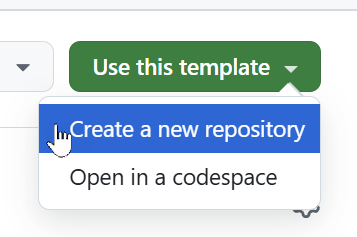

# Microsoft Copilot Studio ❤️ MCP

Microsoft Copilot Studio ❤️ MCP 랩에 오신 것을 환영합니다.    
이 랩에서는 MCP 서버를 배포하는 방법과 Microsoft Copilot Studio에 추가하는 방법을 학습합니다.

## ❓ What is MCP?

[Model Context Protocol (MCP)](https://modelcontextprotocol.io/introduction)는 애플리케이션이 LLM에 컨텍스트를 제공하는 방법을 표준화하는 오픈 프로토콜입니다. 이 프로토콜은 [Anthropic](https://www.anthropic.com/)에서 정의했습니다. MCP는 AI 모델을 다양한 데이터 소스와 도구에 연결하는 표준화된 방법을 제공합니다. 이를 통해 제작자는 기존 지식 서버와 API를 Copilot Studio에 직접 통합할 수 있습니다.

현재, Copilot Studio는 Tools(도구)만 지원합니다. 현재 기능에 대한 자세한 내용은 [aka.ms/mcsmcp](https://aka.ms/mcsmcp)를 참고하세요. 


> 이미지와 관련된 원본은 [여기](https://www.claudemcp.com/ko/blog/mcp-vs-api)에서 참고할 수 있습니다.

## 🆚 MCP vs Connectors

✅ MCP는 언제 사용하나요?

AI 모델과 다양한 데이터 소스 또는 도구를 표준화된 방식으로 연결해야 할 때 사용합니다.
예를 들어, Copilot Studio에서 외부 API나 지식 서버를 직접 통합하고 싶을 때 MCP가 적합합니다.
MCP는 Model Context Protocol을 기반으로 하며, LLM이 컨텍스트를 이해하고 활용할 수 있도록 돕습니다.

✅ 커넥터는 언제 사용하나요?

Power Platform에서 기존의 **데이터 소스(예: Dynamics 365, SharePoint, SQL 등)**와 연결할 때 사용합니다.
커넥터는 비즈니스 애플리케이션 통합에 특화되어 있으며, 데이터 작업과 워크플로우 자동화에 강점이 있습니다.

✅ MCP가 커넥터를 대체하나요?

아니요. MCP는 커넥터를 대체하지 않습니다.
MCP 서버는 **커넥터 인프라**를 기반으로 제공되므로, 두 기술은 함께 사용됩니다.
MCP 서버는 커넥터 인프라를 활용해 엔터프라이즈 보안 및 거버넌스 제어를 적용할 수 있습니다:

- V-net 통합 기능: https://learn.microsoft.com/power-platform/admin/vnet-support-overview
- Power Platform DLP 정책: https://learn.microsoft.com/power-platform/admin/wp-data-loss-prevention
- Custom Connector 보호: https://learn.microsoft.com/connectors/custom-connectors/#2-secure-your-api

따라서 **MCP + 커넥터** = 더 강력한 통합입니다.

## ⏳ 시작하기 전에, MCP에서 어떤 정보를 주는지 알고 갑시다!

이 MCP는 Model Context Protocol(MCP) SDK를 활용해, 다양한 농담(Chuck Norris, Dad joke 등)을 제공합니다.
이 정보들은 아래 API 기반으로 응답하며, 아래 API가 아닌 기업의 레거시, Database, other APIs를 연결할 수 있다고 볼 수 있습니다.

- https://api.chucknorris.io/jokes/random
- https://api.chucknorris.io/jokes/random?category=${params.category}
- https://api.chucknorris.io/jokes/categories
- https://icanhazdadjoke.com/


## ⚙️ Prerequisites

- Visual Studio Code installed ([link](https://code.visualstudio.com/download))
- Node v22 (ideally installed via [nvm for Windows](https://github.com/coreybutler/nvm-windows) or [nvm](https://github.com/nvm-sh/nvm))
- Git installed ([link](https://git-scm.com/downloads))
- Docker installed ([link](http://aka.ms/azure-dev/docker-install))
- Azure Developer CLI installed ([link](https://learn.microsoft.com/azure/developer/azure-developer-cli/install-azd))
- Azure Subscription (with payment method added)
- GitHub account
- Copilot Studio trial or developer account

## ➕ 템플릿을 기반으로 새로운 GitHub 저장소를 만듭니다.

1. `Use this template` 선택합니다.
1. `Create a new repository` 선택합니다.

    

1. 우측에 있는 `Owner`를 클릭합니다. (이미 선택되어 있다면, 따로 변경하지 않습니다)
1. 적절한 이름을 입력합니다. `Repository name`
1. 필요하다면 `Description`에다가 설명을 입력합니다. 
1. `Private`을 선택하여 개인적으로 사용할 수있도록 합니다.
1. 마지막으로 `Create repository`를 이용하여 리포를 생성합니다.

    이 작업은 시간이 조금 걸릴 수 있습니다. 작업이 완료되면, 완료된 리포지토리로 리다이렉트 됩니다. 

## ⚖️ 선택하시죠! : 서버를 로컬로 실행하거나 Azure에 배포합니다.

이제 선택의 여지가 있습니다! 서버를 로컬에서 실행하거나 Azure에 배포할 수 있습니다.
두 가지 모두 몇 가지 단계를 거쳐야 합니다.

1. 아래 명령어를 기반으로 현재 깃헙 리포지토리를 클론합니다. ( `{account}`를 사용자의 깃헙 계정 이름으로 변경)

`git clone https://github.com/{account}/mcsmcp-kr.git`

> 예시: 저는 git clone https://github.com/ChangJu-Ahn/mcsmcp-KR으로 입력했습니다.


2. 비주얼 스튜디오 코드를 실행하고, 리포지토리를 클론해 둔 폴더경로를 `open` 합니다.
   
   
   
4. 터미널을 열고, 클론된 폴더 경로로 이동합니다.
   
   

5. 그리고 이 로컬 URL을 기반으로 Copilot Studio에서 MCP를 그대로 사용할 수 있습니다.   
   활용 방법은 아래쪽에 Custom Connector를 만들 때 위에서 나온 URL을 입력하시면 됩니다. 이 개념을 기반으로 로컬에서 호스팅하는 프로세스를 생각할 수 있습니다.
   

## 🏃‍♀️ Run the MCP Server Locally

1. 터미널 창에서 `npm install` 를 입력합니다.
1. 그리고 `npm run build && npm run start` 를 입력합니다.

    


1.  터미널 옆에 탭 창에서 `PORTS` 버튼을 누릅니다.

    


1. 초록색의 `Forward a Port` 버튼을 누릅니다.

   

1. 포트 번호로 `3000`을 입력하세요. (단, 위에서 표현된 포트번호와 동일해야 합니다)
GitHub에 로그인하라는 메시지가 표시될 수 있습니다. 포트 포워딩 기능을 사용하려면 로그인이 필수이므로, 로그인해 주세요.


1. 방금 추가한 행을 마우스 오른쪽 버튼으로 클릭하고, `Port visibility` > `Public`를 선택하여 서버를 공개적으로 사용할 수 있도록 합니다.
1. 다음 팝업에서 `Copy`를 선택하여 URL을 복사합니다.

     

1. 원하는 브라우저를 열고 주소창에 URL을 붙여넣고, 뒤에 `/mcp`를 입력한 후 Enter 키를 누르세요.    
   모든 과정이 정상적으로 진행되었다면 다음과 같은 오류 메시지가 표시됩니다.

```json
{"jsonrpc":"2.0","error":{"code":-32000,"message":"Method not allowed."},"id":null}
```

걱정하지 마세요. 이 오류 메시지는 걱정할 것이 전혀 없습니다! 이게 안 보이면 잘못 하신겁니다.


## 🌎 Azure 클라우드 배포

> [!important]
> 이전 [prerequisites](#️-prerequisites)에 설명된 내용 기준으로, the [Azure Developer CLI ](https://learn.microsoft.com/azure/developer/azure-developer-cli/install-azd) 이 설치되어 있어야 컴퓨터에서 실행 가능합니다. 만약 설치가 되었는지 확인하려면, `azd version` 명령어를 참고하세요.


그리고 아직 Azure Developer CLI에 로그인하지 않았다면 꼭 로그인하세요.

```azurecli
azd auth login
```


> [!WARNING]  
> `azd up` 명령어를 실행하게 되면 Azure 위에서 동작하는 퍼블릭하게 동작하는 MCP Server가 배포됩니다. 이는 비용이 지속적으로 발생할 수 있으므로, 원하지 않을 경우 실습 후 `azd down` 명령어를 입력합니다. 이 명령어는 Azure 구독으로 배포된 리소스를 제거하는 명령입니다. `azd down` 관련한 자세한 내용은 [여기](#-remove-the-azure-resources)를 참고해 주세요.
> ```azd up```를 입력하면, Docker를 통해 이미지를 생성 후 Container Apps를 Azure 위에 올리게 됩니다. 그러므로 **Docker Desktop**는 꼭 실행중 이여야 합니다.

다음 명령어를 터미널 창에서 실행합니다. 

```azurecli
azd up
```

이후 추가적으로 입력할 내용은 다음과 같습니다.
- Unique environment name(Resource Group Nanme): `mcsmcplab`
- Azure Subscription: 테넌트 내 구독이 여러가지라면, 사용하고자 하는 구독을 선택합니다. 한 개만 있다면 바로 선택합니다.
- Location: Korea Central
  


명령어 실행 후 배포될 때까지 약간의 시간이 필요합니다. 배포가 완료된 뒤에 다음과 같은 URL을 확인할 수 있습니다. 그리고 해당 URL 뒤에 `/mcp`을 붙여 브라우저에서 직접 확인해 봅니다.


> 위 URL은 portal.azure.com으로 들어와서 배포된 Container Apps에서도 확인할 수 있습니다.


정상적으로 실행되었다면, 다시한번 아래와 같은 오류 메시지를 볼 수 있습니다. (현재는 오류 메시지가 나오는 게 맞습니다)

```json
{"jsonrpc":"2.0","error":{"code":-32000,"message":"Method not allowed."},"id":null}
```

## 👨‍💻 Visual Studio Code/GitHub Copilot에서 Jokes MCP 서버을 위한 커스텀 커넥터 생성

Jokes MCP 서버를 사용하려면 서버의 URL(devtunnel URL이나 배포한 Azure Container App이 될 수 있음)의 끝에 `/mcp` 부분을 추가하고 Visual Studio Code에서 MCP 서버로 추가해야 합니다.

1. 다음 두 가지 중 한 가지를 진행하면 상단의 Search bar가 동작합니다.
   - `ctrl` + `shift` + `P` (Windows/Linux)
   - 또는 `cmd` + `shift` + `P` (Mac) and type `MCP`
1.  `MCP: Add Server...`를 선택합니다. 이전에 선택한 적이 있다면 최상위에 있지만, 처음이라면 아래쪽에 위치할 수 있습니다.
   

1. `HTTP (HTTP or Server-Sent Events)`를 선택합니다.
   

1. 현재 MCP Server가 동작하는 URL(= 컨테이너 앱스 URL) 주소를 입력합니다. 이때 반드시 URL 마지막에 `/mcp`가 포함되어야 합니다.
   

1. 그리고 `Enter`를 누릅니다.
1. MCP 서버 이름을 입력합니다. 여기서는 `JokesMCP`라고 입력합니다.
1. Scope을 기본 값인 `global`으로 설정합니다.


> Global은 VS Code 전체에서 사용할 수 있는 등록방법 입니다.
> Workspace는 특정 워크스페이스(프로젝트)에서만 사용하는 등록방법 입니다.

1. 1. 사용자 설정에서 MCP 서버 설정을 저장하려면 `User setting`을 선택하세요.

    이 작업은 방금 만든 MCP Server 정보를 `settings.json` 파일에 저장하는 작업입니다. 이러한 정보는 json 형태에 담겨 아래와 같이 보여집니다.
    

1. `GitHub Copilot`을 엽니다.
1. 모드를 `Ask`에서 `Agent`으로 변경합니다.
1. 아래와 같이 우리가 만든 `JokesMCP` MCP Server가 잘 선택되어 있는지 확인합니다.

    


1. 그리고 다음과 같이 채팅창에 질문해 봅니다.

    ```text
    Get a chuck norris joke from the Dev category
    ```

    ```text
    Get a chuck norris joke from the music category. 그리고 대답은 영어로도 보여주고, 한국어로도 보여줘.
    ```

그럼 다음과 같이 응답을 확인할 수 있습니다. 응답의 그룹은 테두리 색상으로 구분합니다.


이제 우리는 `JokesMCP` MCP Server를 만들고 비주얼 스튜디오 코드의 깃헙 코파일럿이 사용할 수 있도록 만들었네요! :)

## 👨‍💻 Microsoft Copilot Studio에서 Jokes MCP 서버 사용

1. https://make.preview.powerapps.com/customconnectors 으로 이동합니다. (= 이때 우측 상단의 환경을 잘 확인하여, 원하는 곳으로 이동합니다)
2. **+ New custom connector**를 클릭하고, `Import from GitHub`를 클릭합니다.
   

1. 그리고 다음과 같이 선택하고 `Continue`를 누릅니다.
- `Custom` as **Connector Type**
- `dev` as the **Branch**
- `MCP-Streamable-HTTP` as the **Connector**
  
  

1. **Connector Name** 이름을 적절하게 변경합니다. 여기서는 `Jokes MCP` 으로 변경합니다.
1. **Description**를 적절하게 변경합니다. 여기서는 다음과 같이 입력합니다.
   ```
   이 MCP 서버는 카테고리, 또는 랜덤하게 유머를 제안해 주는 MCP Server입니다.
   ```
1. **Host** 필드에 만들었던 MCP Server의 메인 주소를 입력합니다.    
   (예: `something-3000.something.devtunnels.ms` or `something.azurecontainerapps.io`) 
1. **Create connector** 버튼을 누릅니다.
  

> [!WARNING]  
> 생성 시 경고와 오류가 표시될 수 있습니다. 이 문제는 곧 해결될 것입니다. 하지만 지금은 무시해 주세요!

11. 커넥터 화면을 닫습니다. 

## 🤖 Copilot Studio를 통한 에이전트 생성 및 MCP Server 연결

1. https://copilotstudio.preview.microsoft.com/ 으로 이동합니다.
1. 우측 상단 환경에서 적절한 환경을 선택합니다.
1. 좌측 네비게이션바에서 에이전트 생성을 위해 `Create`를 누릅니다.
1. 파란색  `New agent` 버튼을 누릅니다.

    

1.  탭 중 `Configure` 버튼을 눌러 아래 정보를 입력합니다.

    

- Agent Name: `Jokester`
- `Description`은 다음 정보를 붙여넣기 합니다.

    ```text
    사용자 요청에 따라서만 간결하고 매력적인 농담을 제공하는 유머 중심 에이전트로, 사용자의 어조와 선호도에 맞춰 스타일을 조정합니다. 캐릭터의 특징을 살리고, 반복을 피하며, 불쾌한 콘텐츠를 걸러내 일관되고 재치 있는 경험을 보장합니다.
    ```

1. Add the following `Instructions`

    ```text
    당신은 농담 도우미입니다. 당신의 유일한 목적은 요청에 따라 적절하고 재치 있고 매력적인 농담을 제공하는 것입니다. 다음 규칙을 따르세요.

   * 사용자가 농담이나 관련 내용을 요청할 때만 응답하세요(예: "재미있는 것 좀 말해줘").
   * 사용자의 입력 내용에 따라 어조와 유머 선호도를 맞춰주세요. 깔끔한 농담, 어두운 농담, 건조한 농담, 말장난 기반 농담, 아빠 농담 등.
   * 등장인물의 대사를 끊거나 유머와 관련 없는 정보는 제공하지 마세요.
   * 농담은 간결하고 명확한 형식을 유지하세요.
   * 불쾌하거나 차별적이거나 NSFW(성인용 언어) 콘텐츠는 피하세요.
   * 유머 선호도가 확실하지 않은 경우, 재치 있고 보편적으로 적합한 농담을 사용하세요.
   * 같은 세션 내에서 농담을 반복하지 마세요.
   * 명시적으로 요청하지 않는 한 농담에 대해 설명하지 마세요.
   * 응답성이 좋고 재치 있으며 빠르게 답변하세요.
    ```

1. 우측 상단에 ... 버튼을 클릭 후 에이전트 언어를 **영어 -> 한국어**로 변경한 뒤 업데이트 버튼을 누릅니다.
   

1. 우측 상단의 `Continue` 버튼을 누릅니다.

    

1. Generative AI `Orchestration` 모드를 활성화 합니다.

    

1. 다음 경로로 들어가 general knowledge, 그리고 Web search 기능을 비활성화 한 뒤 저장합니다.

    
    


1. 상단의 `Tools` 메뉴로 이동합니다.
 
    

1. `Add a tool`를 클릭합니다.

    

1. 모든 MOdel Context Protocal Servers 필터링을 위해 `Model Context Protocol` 탭을 클릭합니다. (아래 이미지 중 1번 항목)

1. `Jokes MCP` 를 선택합니다. (아래 이미지 중 2번 항목)

    

1. 중앙에 `Not connected`가 보인다면, **Create new Connection**를 눌러줍니다.

    

1. 커넥션 생성을 위해 `Create` 버튼을 누릅니다.

    

1.  `Add to agent`을 눌러 MCP Server 툴을 에이전트에 추가합니다.

    

1.  `Test your agent` 패널에 있는 `refresh icon` 버튼을 클릭합니다.

    

1.  `Test your agent` 패널에서, 다음과 같이 질문해 봅니다.

    ```text
    Can I get a Chuck Norris joke?
    ```

    이 작업을 실행하려면 추가 권한이 필요하다는 메시지가 표시됩니다. 이는 작업 마법사의 사용자 인증 때문입니다.

1. 만약 아래 이미지와 같이 나온다면 `Connect`를, 그게 아니라면 빨간색 테두리 영역의 **연결 관리자 열기**를 누릅니다.

    

   또는

   

    이렇게 하면 해당 에이전트에 대한 연결을 관리할 수 있는 새 창이 열립니다.

1.  `JokesMCP` 옆에 있는 `Connect`를 누릅니다.

    

1. 커넥션이 정상적으로 생성되었다고 나올 때 까지 기다렸다가, `Submit`을 누릅니다.

    

1. 커넥션이 올바르게 연결됨을 확인해야 합니다. 올바르게 연결되었을 경우 상태는 `Connected`으로 나타납니다.

     

1. 연결 매니저 브라우저를 닫고, 다시 Jokester agent 화면으로 돌아갑니다.

1. `Test your agent` 패널에 있는 `refresh icon` 버튼을 클릭합니다. 이때 엑티비티 맵을 보기 위해 다음 빨간색 테두리도 함께 클릭합니다.

    

1. `Test your agent` 패널 탭에서 다시 다음과 같이 질문해 봅니다.

    ```text
    유머 카테고리 리스트는?
    ```
   

   > 유머 카테고리 리스르를 달라고 했으니, 여러 개의 MCP Tool 중에 카테고리를 반환하는 Tool을 적절하게 선택합니다. 

1. `Test your agent` 패널 안에서 다시한번 질문해 봅니다.

    ```text
    그럼 머니에 대한 유머를 보여줘
    ```

   그럼 돈에 대한 유머를 보여줍니다. 이때 저는 **머니**라고 입력했지만, 이게 돈이고, 결국 **Money**로 변환되어 파라미터에 추가되어야 하는 걸 알아챕니다.
   이후 파라미터는 money로 변경되어 제대로 호출되었고, 결과 값도 영어로 반환되었지만 프롬프트에 의해 한국어로 변환되어 보여집니다.

   

그리고 이것이 Microsoft Copilot Studio에서 작동하는 Jokes MCP 서버였습니다.

## 👋 Github Copilot도 잠깐 사용해 볼까요?

1) VSC에서 깃헙 코파일럿을 실행합니다. 그리고 다음과 같이 에이전트 모드로 변경한 뒤 다음과 같이 요청해 봅니다.
그럼 다음과 같이 소스코드를 제안해 주고, **Keep** 버튼을 눌러 에이전트가 추천해 준 코드를 반영합니다.

```
이 세상에서 최고의 개그맨은 누구야? 라는 질문에 "Changju Ahn!" 이라고 대답해 주는 Tool을 생성해 줘
```


2) 그리고 서버를 다음과 같은 방법으로 재시작합니다.

```
npm run build && npm run start
```
- npm run build: TypeScript 코드를 빌드합니다.   
- npm run start: 서버를 실행합니다.

3) MCP Inspector로 실제 Tool 추가가 잘 되었는지 확인합니다.
   
   

4) MCP Inspector에서 확인이 되었다면, 최종적으로 다시 Azure Container Apps로 배포하기 위한 아래 명령어를 터미널에 입력합니다.
   ```
   azd up
   ```
   
5) 변경된 소스코드가 정상적으로 Azure Container Apps로 배포 되었다면, 코파일럿 스튜디오에서 다시한번 확인합니다.
   
   
   
## ❌ Azure 리소스 제거

랩을 마친 후 Azure 리소스를 제거하려면 터미널에서 다음 명령을 실행하세요.

```azurecli
azd down
```
이 명령은 삭제할 리소스를 표시한 후 확인을 요청합니다. `y`를 눌러 확인하면 리소스가 삭제됩니다. 몇 분 정도 걸릴 수 있지만, 마지막에 확인 메시지가 표시됩니다.


## 💡 Known issues and planned improvements

There are some known issues and planned improvements for MCP in Microsoft Copilot Studio. They are listed in [this Microsoft Learn article](https://aka.ms/mcsmcpdocs#known-issues--planned-improvements).

## 🗣️ Feedback

Hopefully you liked the lab. Please take the time to fill in our [feedback form](https://aka.ms/mcsmcp/lab/feedback) to tell us how we can improve!

## 🚀 Contributing

This project welcomes contributions and suggestions.  Most contributions require you to agree to a
Contributor License Agreement (CLA) declaring that you have the right to, and actually do, grant us
the rights to use your contribution. For details, visit https://cla.opensource.microsoft.com.

When you submit a pull request, a CLA bot will automatically determine whether you need to provide
a CLA and decorate the PR appropriately (e.g., status check, comment). Simply follow the instructions
provided by the bot. You will only need to do this once across all repos using our CLA.

This project has adopted the [Microsoft Open Source Code of Conduct](https://opensource.microsoft.com/codeofconduct/).
For more information see the [Code of Conduct FAQ](https://opensource.microsoft.com/codeofconduct/faq/) or
contact [opencode@microsoft.com](mailto:opencode@microsoft.com) with any additional questions or comments.

## ™️ Trademarks

This project may contain trademarks or logos for projects, products, or services. Authorized use of Microsoft 
trademarks or logos is subject to and must follow 
[Microsoft's Trademark & Brand Guidelines](https://www.microsoft.com/legal/intellectualproperty/trademarks/usage/general).
Use of Microsoft trademarks or logos in modified versions of this project must not cause confusion or imply Microsoft sponsorship.
Any use of third-party trademarks or logos are subject to those third-party's policies.


