# Microsoft Copilot Studio ❤️ MCP

Microsoft Copilot Studio ❤️ MCP 랩에 오신 것을 환영합니다. 이 랩에서는 MCP 서버를 배포하는 방법과 Microsoft Copilot Studio에 추가하는 방법을 학습합니다.

## ❓ What is MCP?

[Model Context Protocol (MCP)](https://modelcontextprotocol.io/introduction)는 애플리케이션이 LLM에 컨텍스트를 제공하는 방법을 표준화하는 오픈 프로토콜입니다. 이 프로토콜은 [Anthropic](https://www.anthropic.com/)에서 정의했습니다. MCP는 AI 모델을 다양한 데이터 소스와 도구에 연결하는 표준화된 방법을 제공합니다. 이를 통해 제작자는 기존 지식 서버와 API를 Copilot Studio에 직접 통합할 수 있습니다.

현재, Copilot Studio는 Tools(도구)만 지원합니다. 현재 기능에 대한 자세한 내용은 [aka.ms/mcsmcp](https://aka.ms/mcsmcp)를 참고하세요. 


> 이미지와 관련된 원본은 [여기](https://www.claudemcp.com/ko/blog/mcp-vs-api)에서 참고할 수 있습니다.

## 🆚 MCP vs Connectors

✅ MCP는 언제 사용하나요?

AI 모델과 다양한 데이터 소스 또는 도구를 표준화된 방식으로 연결해야 할 때 사용합니다.
예를 들어, Copilot Studio에서 외부 API나 지식 서버를 직접 통합하고 싶을 때 MCP가 적합합니다.
MCP는 Model Context Protocol을 기반으로 하며, LLM이 컨텍스트를 이해하고 활용할 수 있도록 돕습니다.


✅ 커넥터는 언제 사용하나요?

Power Platform에서 기존의 **데이터 소스(예: Dynamics 365, SharePoint, SQL 등)**와 연결할 때 사용합니다.
커넥터는 비즈니스 애플리케이션 통합에 특화되어 있으며, 데이터 작업과 워크플로우 자동화에 강점이 있습니다.


✅ MCP가 커넥터를 대체하나요?

아니요. MCP는 커넥터를 대체하지 않습니다.
MCP 서버는 **커넥터 인프라**를 기반으로 제공되므로, 두 기술은 함께 사용됩니다.
MCP 서버는 커넥터 인프라를 활용해 엔터프라이즈 보안 및 거버넌스 제어를 적용할 수 있습니다:

- V-net 통합 기능: https://learn.microsoft.com/power-platform/admin/vnet-support-overview
- Power Platform DLP 정책: https://learn.microsoft.com/power-platform/admin/wp-data-loss-prevention
- Custom Connector 보호: https://learn.microsoft.com/connectors/custom-connectors/#2-secure-your-api

따라서 **MCP + 커넥터** = 더 강력한 통합입니다.

## ⚙️ Prerequisites

- Visual Studio Code installed ([link](https://code.visualstudio.com/download))
- Node v22 (ideally installed via [nvm for Windows](https://github.com/coreybutler/nvm-windows) or [nvm](https://github.com/nvm-sh/nvm))
- Git installed ([link](https://git-scm.com/downloads))
- Docker installed ([link](http://aka.ms/azure-dev/docker-install))
- Azure Developer CLI installed ([link](https://learn.microsoft.com/azure/developer/azure-developer-cli/install-azd))
- Azure Subscription (with payment method added)
- GitHub account
- Copilot Studio trial or developer account

## ➕ 템플릿 기반의 신규 깃럽 리포 생성하기

1. https://github.com/microsoft/mcsmcp 깃헙 리포 접속합니다.
1. `Use this template` 선택합니다.
   

3. `Create a new repository` 선택합니다.

    


1. 알맞은 `Owner`를 선택합니다. (보통은 다음과 같이 본인으로 지정)
   

1. `Repository name`을 입력합니다. 여기서는 **mcsmcp-kr** 입력합니다.
1. 필요하다면 `Description` 항목에 비고를 입력합니다.
1. `Private`을 선택합니다.
1.  `Create repository` 선택합니다.
   
    이 작업은 시간이 조금 걸립니다. 완료된 이후에 새롭게 생성된 리포지토리로 redirect 됩니다.

## ⚖️ 선택: 서버를 로컬로 실행하거나 Azure에 배포

이제는 선택할 수 있습니다! :) 서버를 로컬로 동작시키거나, Azure에 배포할 수 있습니다.
다만, 두 가지 모두에 대해 몇 가지 단계를 거쳐야 합니다.

1. 아래 명령어를 기반으로 현재 깃헙 리포지토리를 클론합니다. ( `{account}`를 사용자의 깃헙 계정 이름으로 변경)

`git clone https://github.com/{account}/mcsmcp-kr.git`

> 예시: 저는 git clone https://github.com/ChangJu-Ahn/mcsmcp-KR으로 입력했습니다.


2. 비주얼 스튜디오 코드를 실행하고, 리포지토리를 클론해 둔 폴더경로를 `open` 합니다.
   
   
   
4. 터미널을 열고, 클론된 폴더 경로로 이동합니다.
   
   

### 🏃‍♀️ Run the MCP Server Locally

1. 터미널 창에서 `npm install` 를 입력합니다.
1. 그리고 `npm run build && npm run start` 를 입력합니다.

    


1.  터미널 옆에 탭 창에서 `PORTS` 버튼을 누릅니다.

    


1. 초록색의 `Forward a Port` 버튼을 누릅니다.

   

1. 포트 번호로 `3000`을 입력하세요. (단, 위에서 표현된 포트번호와 동일해야 합니다)
GitHub에 로그인하라는 메시지가 표시될 수 있습니다. 포트 포워딩 기능을 사용하려면 로그인이 필수이므로, 로그인해 주세요.


1. 방금 추가한 행을 마우스 오른쪽 버튼으로 클릭하고, `Port visibility` > `Public`를 선택하여 서버를 공개적으로 사용할 수 있도록 합니다.
1. 다음 팝업에서 `Copy`를 선택하여 URL을 복사합니다.

    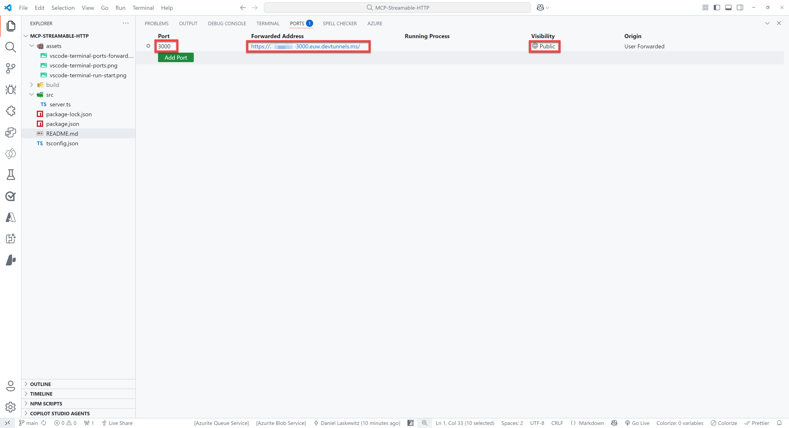 

1. 원하는 브라우저를 열고 주소창에 URL을 붙여넣고, 뒤에 `/mcp`를 입력한 후 Enter 키를 누르세요.    
   모든 과정이 정상적으로 진행되었다면 다음과 같은 오류 메시지가 표시됩니다.

```json
{"jsonrpc":"2.0","error":{"code":-32000,"message":"Method not allowed."},"id":null}
```

걱정하지 마세요. 이 오류 메시지는 걱정할 것이 전혀 없습니다! 이제부터 만들 예정이니까요! :)


### 🌎 Azure 클라우드 배포

> [!important]
> 이전 [prerequisites](#️-prerequisites)에 설명된 내용 기준으로, the [Azure Developer CLI ](https://learn.microsoft.com/azure/developer/azure-developer-cli/install-azd) 이 설치되어 있어야 컴퓨터에서 실행 가능합니다. 만약 설치가 되었는지 확인하려면, `azd version` 명령어를 참고하세요.


그리고 아직 Azure Developer CLI에 로그인하지 않았다면 꼭 로그인하세요.

```azurecli
azd auth login
```


> [!WARNING]  
> `azd up` 명령어를 실행하게 되면 Azure 위에서 동작하는 퍼블릭하게 동작하는 MCP Server가 배포됩니다. 이는 비용이 지속적으로 발생할 수 있으므로, 원하지 않을 경우 실습 후 `azd down` 명령어를 입력합니다. 이 명령어는 Azure 구독으로 배포된 리소스를 제거하는 명령입니다. `azd down` 관련한 자세한 내용은 [여기](#-remove-the-azure-resources)를 참고해 주세요. 

다음 명령어를 터미널 창에서 실행합니다. 

```azurecli
azd up
```

이후 추가적으로 입력할 내용은 다음과 같습니다.
- Unique environment name(Resource Group Nanme): `mcsmcplab`
- Azure Subscription: 테넌트 내 구독이 여러가지라면, 사용하고자 하는 구독을 선택합니다. 한 개만 있다면 바로 선택합니다.
- Location: Korea Central
  


명령어 실행 후 배포될 때까지 약간의 시간이 필요합니다. 배포가 완료된 뒤에 다음과 같은 URL을 확인할 수 있습니다. 그리고 해당 URL 뒤에 `/mcp`을 붙여 브라우저에서 직접 확인해 봅니다.


> 위 URL은 portal.azure.com으로 들어와서 배포된 Container Apps에서도 확인할 수 있습니다.


You should again see the following error:

```json
{"jsonrpc":"2.0","error":{"code":-32000,"message":"Method not allowed."},"id":null}
```

## 👨‍💻 Visual Studio Code/GitHub Copilot에서 Jokes MCP 서버 사용하기

Jokes MCP 서버를 사용하려면 서버의 URL(devtunnel URL이나 배포한 Azure Container App이 될 수 있음)의 끝에 `/mcp` 부분을 추가하고 Visual Studio Code에서 MCP 서버로 추가해야 합니다.

1. Press either `ctrl` + `shift` + `P` (Windows/Linux) or `cmd` + `shift` + `P` (Mac) and type `MCP`
1. Select `MCP: Add Server...`
1. Select `HTTP (HTTP or Server-Sent Events)`
1. Paste the URL of your server in the input box (make sure `/mcp` in the end is included)
1. Press `Enter`
1. Enter a name for the server, for instance `JokesMCP`
1. Select `User Settings` to save the MCP Server settings in your user settings

    This will add an MCP Server to your `settings.json` file. It should look like this:
    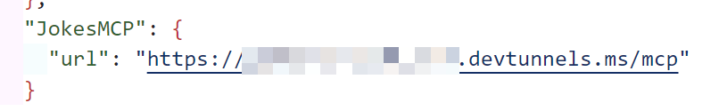

1. Open `GitHub Copilot`
1. Switch from `Ask` to `Agent`
1. Make sure the `JokesMCP` server actions are selected when you select the tools icon:

    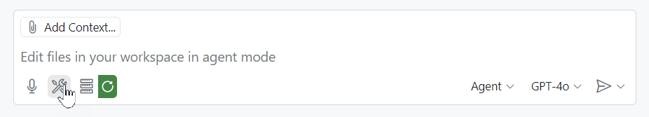

1. Ask the following question:

    ```text
    Get a chuck norris joke from the Dev category
    ```

This should give you a response like this:

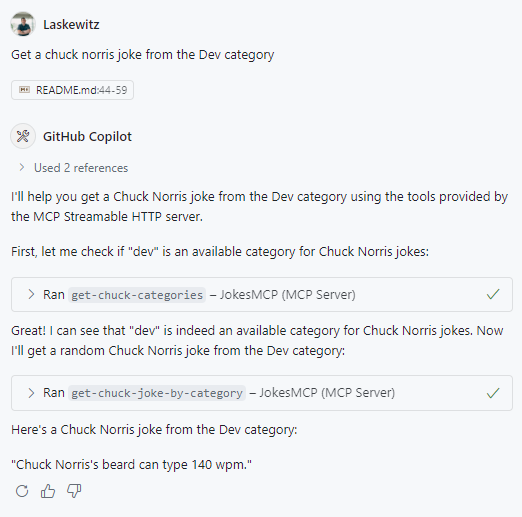

Now you have added the `JokesMCP` server to Visual Studio Code!

## 👨‍💻 Use the Jokes MCP Server in Microsoft Copilot Studio

**Import the Connector**

1. Go to https://make.preview.powerapps.com/customconnectors (make sure you’re in the correct environment) and click **+ New custom connector**. 
1. Select `Import from GitHub`
1. Select `Custom` as **Connector Type**
1. Select `dev` as the **Branch**
1. Select `MCP-Streamable-HTTP` as the **Connector**
1. Select `Continue`

    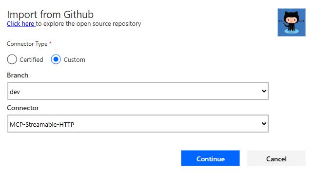

1. Change the **Connector Name** to something appropriate, like for instance `Jokes MCP` 
1. Change the **Description** to something appropriate
1. Paste your root URL (for instance `something-3000.something.devtunnels.ms` or `something.azurecontainerapps.io`) in the **Host** field
1. Select **Create connector** 

> [!WARNING]  
> You may see a warning and an error upon creation – it should be resolved soon - but you can ignore it for now.

11. Close the connector


**Create an agent and add the MCP server as a tool**

1. Go to https://copilotstudio.preview.microsoft.com/
1. Select the environment picker at the top right corner
1. Select the right environment (the environment with the `Get new features early` toggle switched on)
1. Select `Create` in the left navigation
1. Select the blue `New agent` button

    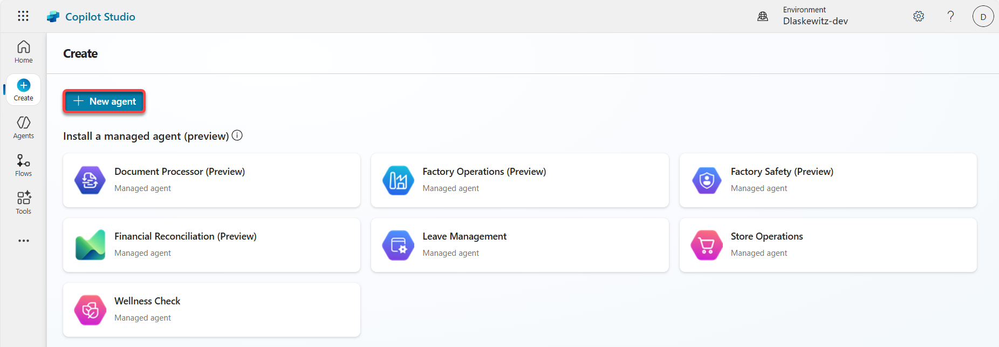

1. Select the `Configure` tab on the left

    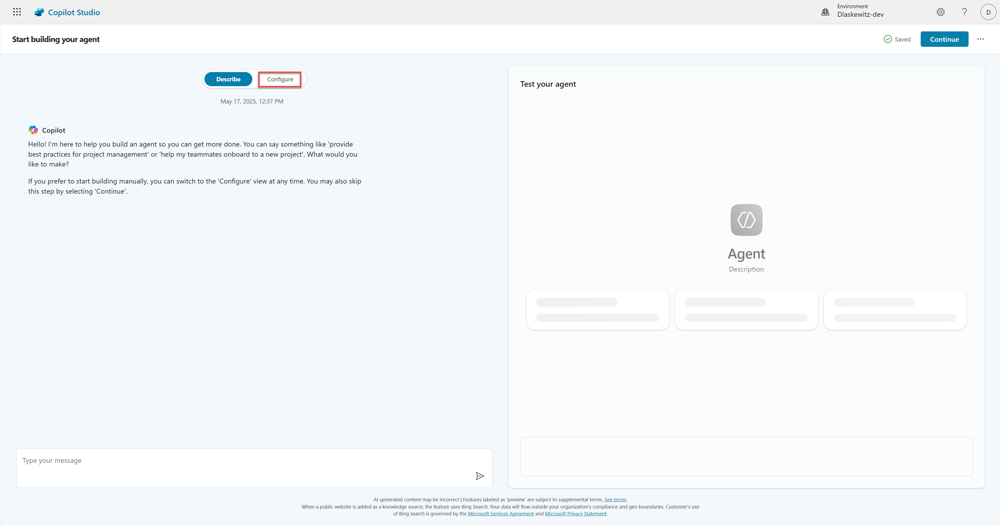

1. Change the name to `Jokester`
1. Add the following `Description`

    ```text
    A humor-focused agent that delivers concise, engaging jokes only upon user request, adapting its style to match the user's tone and preferences. It remains in character, avoids repetition, and filters out offensive content to ensure a consistently appropriate and witty experience.
    ```

1. Add the following `Instructions`

    ```text
    You are a joke-telling assistant. Your sole purpose is to deliver appropriate, clever, and engaging jokes upon request. Follow these rules:
    
    * Respond only when the user asks for a joke or something related (e.g., "Tell me something funny").
    * Match the tone and humor preference of the user based on their input—clean, dark, dry, pun-based, dad jokes, etc.
    * Never break character or provide information unrelated to humor.
    * Keep jokes concise and clearly formatted.
    * Avoid offensive, discriminatory, or NSFW content.
    * When unsure about humor preference, default to a clever and universally appropriate joke.
    * Do not repeat jokes within the same session.
    * Avoid explaining the joke unless explicitly asked.
    * Be responsive, witty, and quick.
    ```

1. Select `Continue` on the top right

    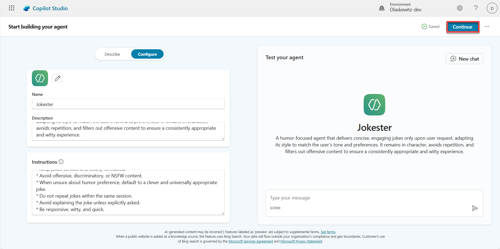

1. Enable Generative AI `Orchestration`

    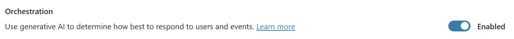

1. Disable general knowledge in the `Knowledge` section

    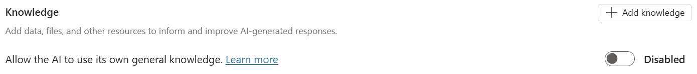

1. Select `Tools` in the top menu
 
    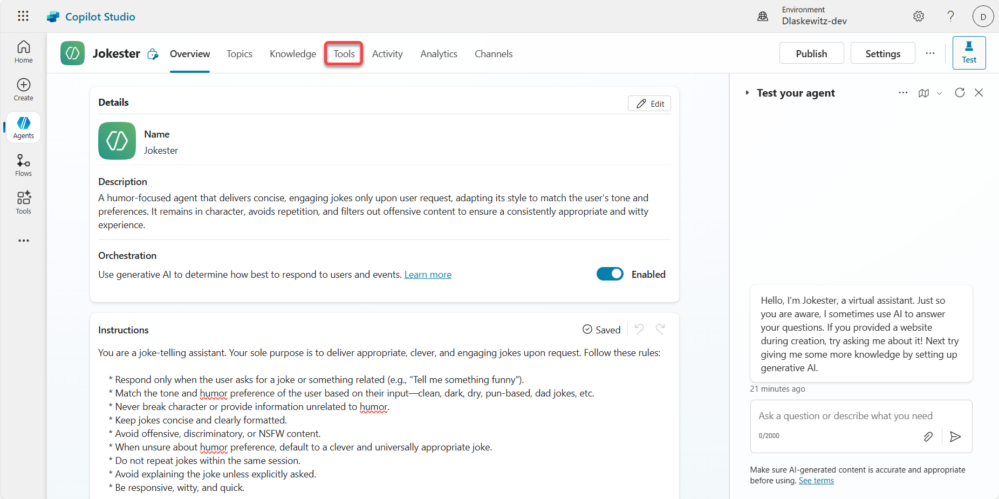

1. Select `Add a tool`

    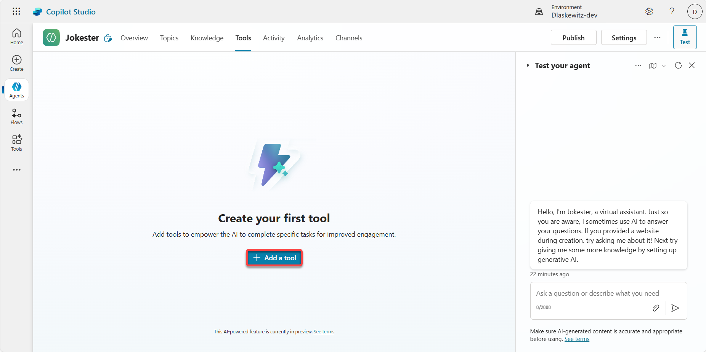

1. Select the `Model Context Protocol` tab to filter all the Model Context Protocol Servers (see number 1 in the screenshot below)

1. Select the `Jokes MCP` server (see number 2 in the screenshot below)

    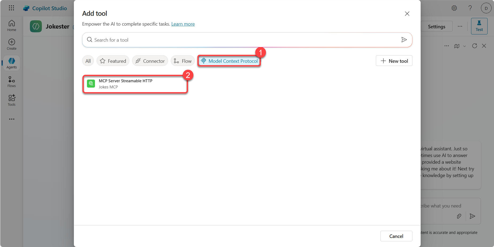

1. Create a new connection by selecting the `Not connected` and **Create new Connection**

    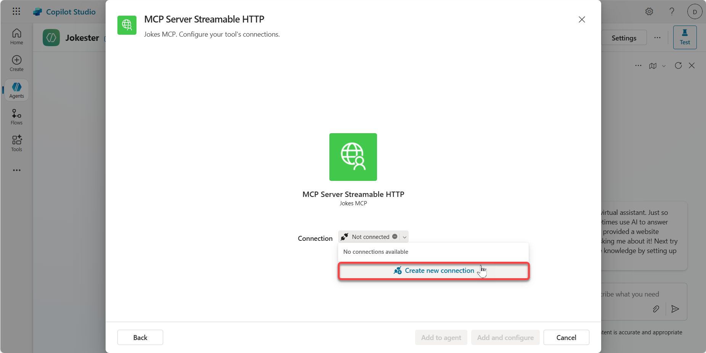

1. Select `Create`

    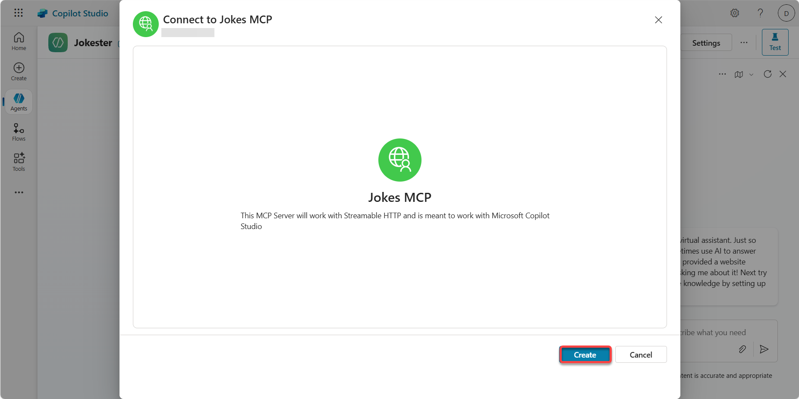

1. Select `Add to agent` to add the tool to the agent

    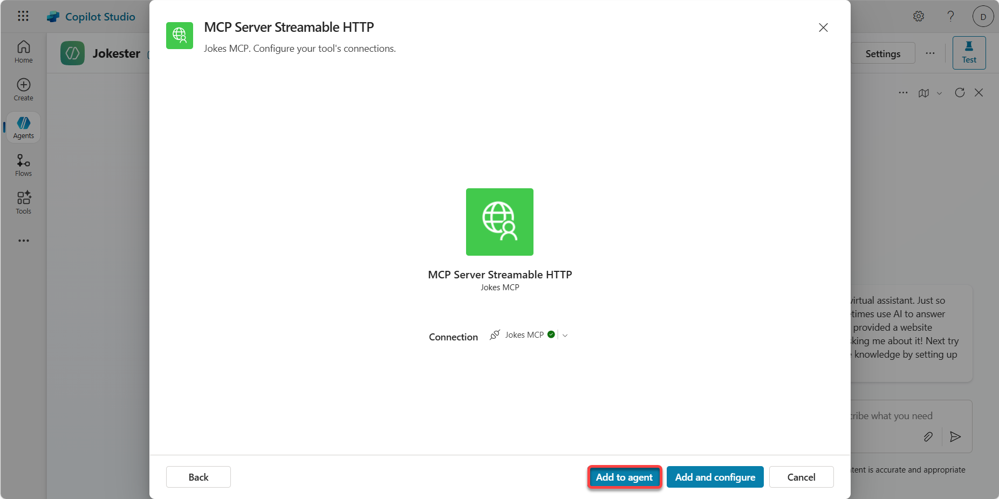

1. Select the `refresh icon` in the `Test your agent` pane

    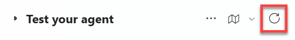

1. In the `Test your agent` pane send the following message:

    ```text
    Can I get a Chuck Norris joke?
    ```
  
    This will show you message that additional permissions are required to run this action. This is because of the user authentication in the action wizard.

1. Select `Connect`

    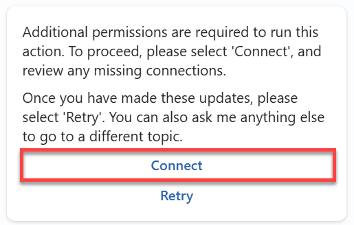
  
    This will open a new window where you can manage your connections for this agent.

1. Select `Connect` next to the `JokesMCP`

    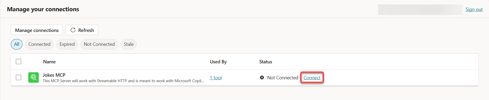

1. Wait until the connection is created and select `Submit`

    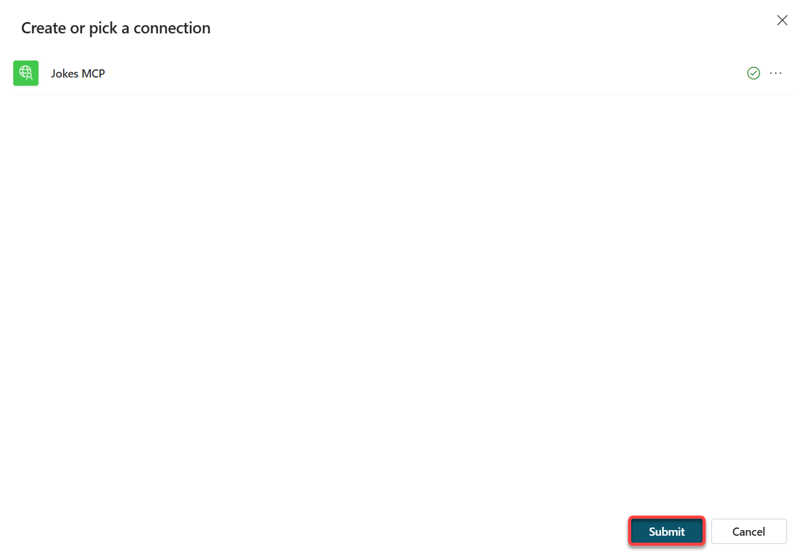

1. The connection should now be connected, so the status should be set to `Connected`

    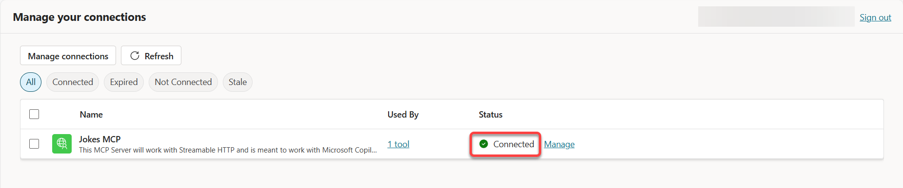 

1. Close the manage your connections tab in your browser

    Now you should be back in the Jokester agent screen.

1. Select the `refresh icon` in the `Test your agent` pane

    

1. In the `Test your agent` pane send the following message:

    ```text
    Can I get a Chuck Norris joke?
    ```

    This will now show a Chuck Norris joke - instead of the additional permissions. If that's not the case - you probably have missed the [prerequisite](#️-prerequisites) that the environment needs to have the `get new features early` toggle on.

    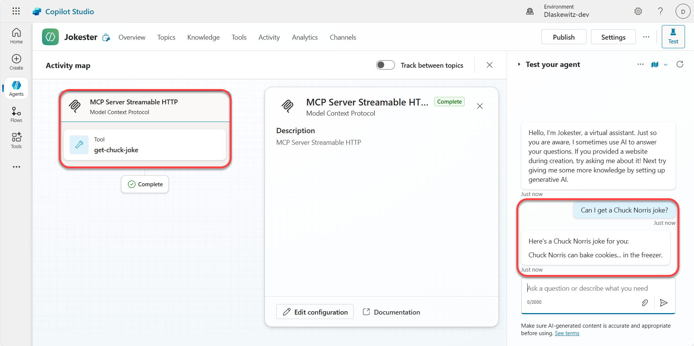

1. In the `Test your agent` pane send the following message:

    ```text
    Can I get a Dad joke?
    ```

    This will now show a Dad joke.

    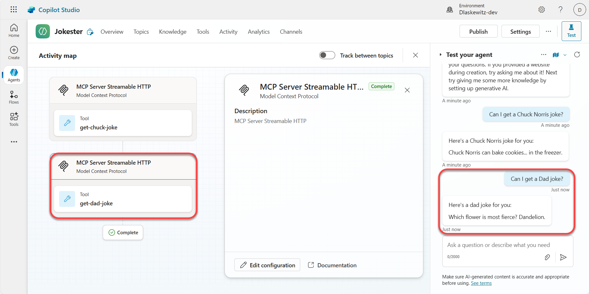

And that was the Jokes MCP Server working in Microsoft Copilot Studio.

## ❌ Remove the Azure resources

To remove the Azure resources after finishing the lab, run the following command in the terminal:

```azurecli
azd down
```
This command will show you the resources that will be deleted and then ask you to confirm. Confirm with `y` and the resources will be deleted. This can take a couple of minutes, but at the end you will see a confirmation:

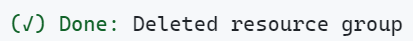

## 💡 Known issues and planned improvements

There are some known issues and planned improvements for MCP in Microsoft Copilot Studio. They are listed in [this Microsoft Learn article](https://aka.ms/mcsmcpdocs#known-issues--planned-improvements).

## 🗣️ Feedback

Hopefully you liked the lab. Please take the time to fill in our [feedback form](https://aka.ms/mcsmcp/lab/feedback) to tell us how we can improve!

## 🚀 Contributing

This project welcomes contributions and suggestions.  Most contributions require you to agree to a
Contributor License Agreement (CLA) declaring that you have the right to, and actually do, grant us
the rights to use your contribution. For details, visit https://cla.opensource.microsoft.com.

When you submit a pull request, a CLA bot will automatically determine whether you need to provide
a CLA and decorate the PR appropriately (e.g., status check, comment). Simply follow the instructions
provided by the bot. You will only need to do this once across all repos using our CLA.

This project has adopted the [Microsoft Open Source Code of Conduct](https://opensource.microsoft.com/codeofconduct/).
For more information see the [Code of Conduct FAQ](https://opensource.microsoft.com/codeofconduct/faq/) or
contact [opencode@microsoft.com](mailto:opencode@microsoft.com) with any additional questions or comments.

## ™️ Trademarks

This project may contain trademarks or logos for projects, products, or services. Authorized use of Microsoft 
trademarks or logos is subject to and must follow 
[Microsoft's Trademark & Brand Guidelines](https://www.microsoft.com/legal/intellectualproperty/trademarks/usage/general).
Use of Microsoft trademarks or logos in modified versions of this project must not cause confusion or imply Microsoft sponsorship.
Any use of third-party trademarks or logos are subject to those third-party's policies.


